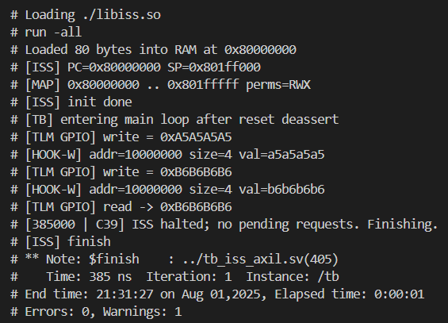

# HW/SW Co-Simulation: RISC-V Firmware ↔ Unicorn ISS ↔ SystemVerilog AXI-Lite

This repo demonstrates a minimal HW/SW co-simulation stack:

- **Firmware** (RISC-V RV32) that performs MMIO to a GPIO block.
- **ISS bridge** in C built on **Unicorn** that traps unmapped MMIO and forwards it to SV via DPI.
- **SystemVerilog testbench** with an **AXI-Lite** GPIO slave and master tasks to service the ISS requests.

---

## 1) Architecture Overview

```
           +-------------------+        DPI-C        +---------------------+
           |    Firmware       |<------------------->|   ISS Driver (C)    |
           |  (fw.c, _start.S) |                     |  Unicorn RISC-V32   |
           +---------+---------+     req/resp        |  RAM @ 0x8000_0000  |
                     | MMIO @0x1000_0000             |  GPIO unmapped      |
                     v                               +----+----------------+
            (unmapped in Unicorn)                        |
                                                        uc_emu_stop on MMIO
                                                        |
                                                        v
           +-------------------+   AXI-Lite (SV tasks)  +---------------------+
           |   SV Testbench    |<---------------------->|  gpio_axil_slave    |
           | - axil_write/read |                        |  reg_data/reg_dir   |
           | - services DPI    |----------------------> |  (OKAY/DECERR)      |
           +-------------------+        signals         +---------------------+
```

**Flow:** firmware executes on Unicorn ⟶ MMIO hits **unmapped** region ⟶ C hooks raise request & stop emu ⟶ SV master performs AXI-Lite ⟶ SV acks (and retires write) ⟶ resume emulation.

---

## 2) Modules & Interconnection

### Firmware

- `fw.c`: writes two 32-bit patterns to `0x1000_0000`, reads back, then `ebreak`.
- `_start.S`: places `_start` in a kept section, sets `sp`, calls `main`, loops if main returns.
- `linker.ld`: links `.text` at `0x8000_0000` (matches Unicorn RAM base).

### ISS Driver (`iss_driver.c`)

- Maps **RAM** at `0x8000_0000` (2 MiB).
- Leaves **GPIO** (`0x1000_0000..0x1000_0FFF`) **unmapped** so loads/stores trap.
- Installs **unmapped** hooks:
  - `hook_mmio_write_unmapped()`: capture `addr/wdata`, mark as **WRITE**, `uc_emu_stop()`.
  - `hook_mmio_read_unmapped()`: capture `addr`, mark as **READ**, `uc_emu_stop()`.
- DPI API:
  - `iss_step()`: time-sliced single step (or small slice).
  - `iss_get_req(addr, wdata, write)`: 0=READ, 1=WRITE.
  - `iss_ack_write_and_advance()`: SV acknowledges a completed write (owner of retirement).
  - `iss_set_read_data(data)`: SV supplies read data to complete the read path.

### SystemVerilog Testbench (`tb_iss_axil.sv`)

- **AXI-Lite master** tasks:
  - `axil_write(addr, data, ok)`: early `BREADY`, handshake checks, timeouts.
  - `axil_read(addr, data, ok)`: early `RREADY`, **advances time inside wait loops**.
- **Service loop**:
  1. `iss_step()`
  2. `iss_get_req(...)`
  3. if **write**: `axil_write(...)` → `iss_ack_write_and_advance()`
     else: `axil_read(...)` → `iss_set_read_data(data)`
- **GPIO AXI-Lite slave**:
  - Two registers: `reg_data` @ `+0x0`, `reg_dir` @ `+0x4`.
  - 1-cycle pulses for `AWREADY/WREADY/ARREADY`.
  - `OKAY` for valid offsets; `DECERR` default.

> **Tip:** If you decouple AW/W across cycles, latch `AWADDR` at its handshake and use the latched address when W completes.

---

## 3) Design Techniques

- **Unmapped-MMIO bridging:** device window left unmapped so **all MMIO** goes through hooks (no shadow state).
- **Blocking on MMIO:** hooks call `uc_emu_stop()` to hand control to SV deterministically.
- **Single owner of retirement (writes):** avoid double-advance; PC retirement happens once (e.g., in `iss_ack_write_and_advance()`).
- **Robust AXI-Lite master:** early ready, timeouts, and `@(posedge clk)` inside loops to see 1-cycle pulses.
- **Minimal entry stub:** stable entry, stack init, call `main`.

---

## 4) Build & Run

### Prereqs

- RISC-V toolchain (`riscv32-unknown-elf-*` or equivalent): can be built and installed by running `./build_rv_toolchain.sh`
- SystemVerilog simulator with DPI-C (e.g., ModelSim/Questa).
- Unicorn library/headers: can be built and installed by running `build_unicorn.sh`

### A) Build firmware (ELF + flat binary)

```bash
# Toolchain
CROSS=riscv32-unknown-elf
CFLAGS="-march=rv32im -mabi=ilp32 -Os -ffreestanding -nostartfiles -nostdlib"

# Compile
$CROSS-gcc $CFLAGS -c _start.S   -o _start.o
$CROSS-gcc $CFLAGS -c fw.c       -o fw.o

# Link (linker.ld places .text at 0x80000000 and keeps .text.entry/_start)
$CROSS-gcc $CFLAGS -T linker.ld _start.o fw.o -o fw.elf

# Inspect (optional)
$CROSS-objdump -dS fw.elf | less
$CROSS-size fw.elf

# Flat binary for Unicorn
$CROSS-objcopy -O binary fw.elf fw.bin
```

### B) Build ISS shared library

```bash
# Adjust include/lib paths to your Unicorn install
gcc -fPIC -shared -O2 \
  -o libiss.so iss_driver.c -lunicorn
```

### C) Run simulation (ModelSim/Questa example)

```tcl
vlib work
vlog tb_iss_axil.sv
vsim -c -sv_lib ./libiss tb -do "run -all; quit -f"
```

**Expected:** two writes to `0x1000_0000`, a readback of the last write, then `ebreak` halts the run.

---

## 5) Repository Layout

```
.
├── fw.c            # Firmware: MMIO write, write, read, ebreak
├── _start.S        # Entry stub: set sp, call main
├── linker.ld       # Link at 0x8000_0000; keep .text.entry
├── iss_driver.c    # Unicorn <-> DPI bridge, hooks, step/req/ack
└── tb_iss_axil.sv  # SV TB with AXI-Lite master/slave & DPI loop
```

---

## 6) Notes & Extensions

- **Compressed ISA (RVC):** if enabled, compute retirement length at PC (low 2 bits `!= 3` ⇒ 16-bit; else 32-bit).
- **Timing realism:** add wait-states in the SV slave between address/data phases.
- **Protocol checks:** add AXI-Lite assertions (alignment, response, single outstanding tx).
- **Scaling up:** add more MMIO blocks by extending unmapped ranges and SV services.


## 7) Simulation Screenshot

Running the RTL simulation using QuestaSim shows the write transactions and read transactions implemented in the firmware `fw.c`:


